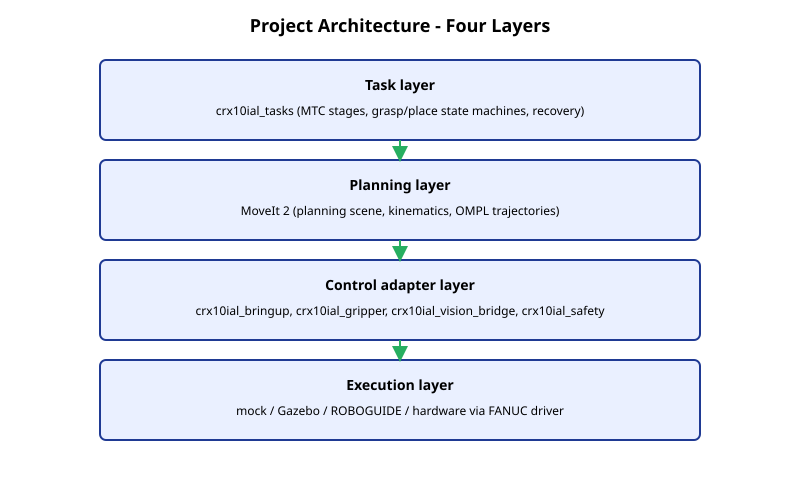
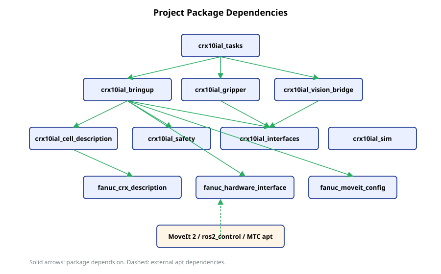
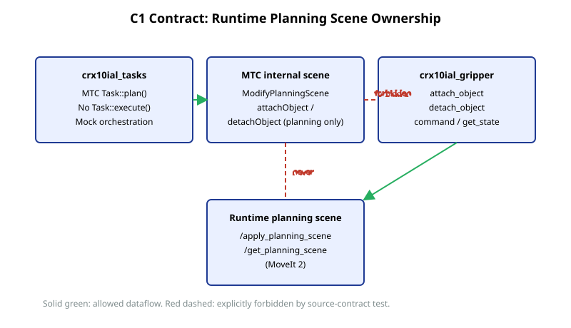

# Architecture

This document explains how the project is organized into layers and packages, and how data flows between them. For background on individual technologies, see [concepts/software_overview.md](concepts/software_overview.md).

## Four-layer architecture

The architecture (from the design document, section 8) has four layers:

- **Task layer** owns higher-level intent. In M3 this is the fixed pick/place pipeline built with MoveIt Task Constructor. Recovery and grasp/place state machines live here. The task layer never calls FANUC register services directly.
- **Planning layer** is MoveIt 2. It owns the planning scene, kinematics, collision checking, and trajectory generation. It exposes services like `/plan_kinematic_path` and `/apply_planning_scene`.
- **Control adapter layer** is where this project's mode-specific composition lives: `crx10ial_bringup` chooses launch mode, `crx10ial_gripper` abstracts end-effector commands, `crx10ial_vision_bridge` adapts vision sources, `crx10ial_safety` adds non-safety-rated runtime guards.
- **Execution layer** is the underlying engine: mock hardware, Gazebo (M4), ROBOGUIDE (M6), or the real controller (M7). The FANUC ROS 2 driver bridges this layer to ros2_control.

This boundary keeps the task layer stable while the simulator, controller, gripper hardware, or vision source change underneath.

## Package responsibilities

| Package | Build type | Role |
|---|---|---|
| `crx10ial_interfaces` | ament_cmake | Shared `.srv` definitions: `CommandGripper`, `AttachObject`, `DetachObject`, `GetGripperState`. |
| `crx10ial_cell_description` | ament_cmake | Workcell xacro composing FANUC robot, table, work object, camera stand, gripper, frames. Single source of truth for `robot_description`. |
| `crx10ial_bringup` | ament_python | Mode launches: mock today, gazebo/roboguide/hardware in later milestones. Owns the static planning-scene publisher (`mock_scene`). |
| `crx10ial_gripper` | ament_python | Fake gripper backend and ROS 2 services. Sole owner of runtime attach/detach planning-scene writes. |
| `crx10ial_tasks` | ament_cmake | M3 fixed pick/place using MTC plus mock execution orchestration. |
| `crx10ial_vision_bridge` | ament_cmake | Vision adapter boundary for fake/sim/iRVision detection backends (M5+). |
| `crx10ial_safety` | ament_cmake | Non-safety-rated runtime guard package (workspace limits, recovery helpers). |
| `crx10ial_sim` | ament_cmake | Gazebo Fortress integration boundary (M4). |
| `crx10ial_tests` | ament_cmake | Cross-package launch and integration tests (deferred). |

## Package dependency graph

Arrows mean "depends on". The dashed line at the bottom marks external apt dependencies (MoveIt, MTC, ros2_control) that all upper packages share through ROS 2 build infrastructure.

## Data flow in mock mode

The mock launch wires this graph:

1. `crx10ial_bringup/mock.launch.py` expands the cell xacro from `crx10ial_cell_description`. The expanded URDF includes both the robot and the FANUC `crx_mock_ros2_control` macro.
2. `robot_state_publisher` publishes `/tf` from the URDF and joint states.
3. `controller_manager` (`ros2_control_node`) consumes the same URDF and starts the FANUC mock hardware interface plus controllers (joint_state_broadcaster, joint_trajectory_controller, fanuc_gpio_controller, fanuc_force_sensor_broadcaster, force_torque_sensor_broadcaster).
4. `move_group` loads the cell URDF and the FANUC SRDF, exposing `/plan_kinematic_path`, `/apply_planning_scene`, etc.
5. `crx10ial_bringup/mock_scene_node.py` publishes static workcell collision objects (table, work_object, camera_stand) to `/collision_object`.
6. `crx10ial_gripper/fake_gripper_node.py` exposes `command`, `attach_object`, `detach_object`, `get_state` and applies attach/detach diffs to the runtime planning scene through `/apply_planning_scene`.

The cell xacro is the single robot_description source; see [decisions/0005](decisions/0005-cell-xacro-as-single-robot-description.md). The mock launch composes the same FANUC mock controllers as the upstream FANUC mock launch, but starts them locally so the URDF is not expanded twice.

## C1 contract

The C1 contract is the rule that runtime planning-scene writes for attached objects flow through `crx10ial_gripper` only.

- MTC stages (`ModifyPlanningScene::attachObject`, `detachObject`) update the planner's internal scene during `Task::plan()`.
- The project never calls `Task::execute()`. Doing so would also write the runtime scene through MTC's executor.
- Runtime attach/detach goes through `crx10ial_gripper`'s services. The gripper service applies the scene diff via `/apply_planning_scene`.

This contract is enforced by source-contract pytests in `crx10ial_tasks` and by a runtime check (`/get_planning_scene` after attach asserts exactly one attached `work_object` and zero world duplicates). See [decisions/0003](decisions/0003-fake-gripper-as-runtime-scene-owner.md) for the full rationale.

## Where new code goes

- New planning logic: `crx10ial_tasks`.
- New gripper hardware support: a new backend module under `crx10ial_gripper`, sharing the existing service interface.
- New vision source: a new backend under `crx10ial_vision_bridge`, sharing a future `DetectObject` interface.
- New simulator mode: `crx10ial_sim` plus a new launch in `crx10ial_bringup`.
- A new workcell element (table, sensor, fixture): cell xacro in `crx10ial_cell_description` plus the matching collision in `mock_scene` (or a new publisher if it must move).
