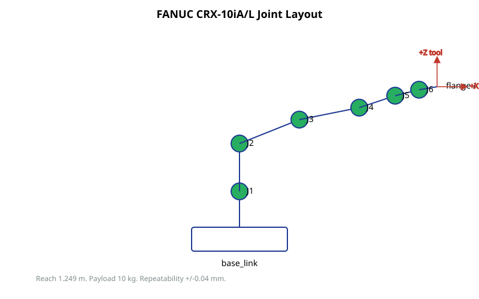

# Hardware Overview

This document describes the physical hardware that the project targets.

## Robot

The target robot is the FANUC CRX-10iA/L collaborative robot.

- 6 articulated axes (J1, J2, J3, J4, J5, J6).
- Reach: 1.249 m.
- Payload: 10 kg.
- Repeatability: +/-0.04 mm.
- Mass: ~40 kg.
- Cooperative speed limit at force-sensitive operation.

The robot exposes several frames that ROS 2 cares about:

- `world` - workspace root, attached to the cell base.
- `base_link` - robot base.
- `J1`..`J6` link frames.
- `flange` - mechanical interface for tool attachment.
- `tool0` - FANUC default tool frame at flange.
- Project-specific extensions: `end_effector`, `tool_link`, `grasp_link` (see `docs/frames.md`).

## Controller

The controller is the FANUC R-30iB Mini Plus or equivalent.

Relevant software options for ROS 2 integration:

- **J519 Stream Motion** - high-rate joint streaming. Required by the FANUC ROS 2 driver for trajectory execution.
- **R912 Remote Motion Interface (RMI)** - command and status path used by the driver.
- **S636 External Control Package** - alternative external command path.
- **iRVision** - FANUC built-in vision system. Used in the project as a controller-side feature; see `docs/decisions/0003-fake-gripper-as-runtime-scene-owner.md` for ownership boundary.

The Teach Pendant is the operator interface and is the source of authority for safety. Dual Check Safety (DCS) and reduced-speed mode are configured here, not in ROS 2.

## I/O and Registers

FANUC controllers expose several data spaces:

- **Digital I/O** - DI[] (input), DO[] (output). Used for triggers and status.
- **Analog I/O** - AI[], AO[].
- **Group I/O** - GI[], GO[]. Bundles of digital lines.
- **Robot I/O** - RI[], RO[]. Robot-specific lines (handshake bits).
- **Numeric registers** - R[]. Integer or real values for program control.
- **Position registers** - PR[]. Stored Cartesian or joint poses.

iRVision results are typically published into R[] and PR[] by a TP program after image processing.

## Network

The Linux ROS 2 host and the controller communicate over Ethernet. Required:

- A static IP for the robot, reachable from the ROS 2 PC.
- Subnet that does not collide with other engineering networks.
- Firewall openings for J519 / RMI ports as documented by FANUC.

See `docs/concepts/system_block_diagram.md` for the high-level layout.

## Safety

ROS 2 is not safety-rated in this project. Authority for stopping the robot, enforcing speed limits, and validating payload remains with:

- The FANUC controller and its DCS configuration.
- The Teach Pendant operator.
- An external emergency stop integrated into the cell.

ROS 2 application code may add convenience guards (workspace limits, recovery flows) but those are not safety functions. See `docs/decisions/0001-adopt-ubuntu22-humble.md` and the project safety section in operations docs.
