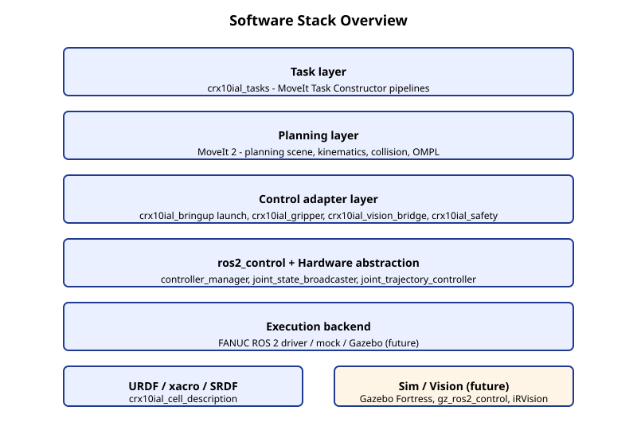

# Software Overview

This project runs on Ubuntu 22.04 with ROS 2 Humble. The software is layered to keep concerns separable: planning logic stays independent of which simulator or controller is on the other end.

## ROS 2 Humble

ROS 2 Humble Hawksbill is the LTS distribution targeted at Ubuntu 22.04. Core concepts the rest of this document assumes the reader knows:

- **Node** - a process publishing/subscribing/serving ROS interfaces.
- **Topic** - typed asynchronous publish/subscribe channel.
- **Service** - synchronous request/response.
- **Action** - long-running goal/feedback/result.
- **Parameter** - per-node typed configuration.
- **Launch** - Python file that composes nodes, parameters, and includes.

The project uses `colcon` for building and `vcstool` for fetching upstream source dependencies. Both come from the standard ROS 2 install.

## URDF / xacro / SRDF

`crx10ial_cell_description` owns the workcell description.

- **URDF** is the rigid-body model: links, joints, meshes, masses, collision geometry.
- **xacro** is a templating layer over URDF; the cell composition uses `<xacro:macro>` and `<xacro:include>` to compose the FANUC robot description, the workcell environment (table, work object, camera stand), and the gripper.
- **SRDF** is MoveIt's semantic description: planning groups, named states, end-effector names, allowed-collision matrix overrides.

The cell xacro is the single source of truth for `robot_description`. It serves both MoveIt and ros2_control. See `docs/decisions/0005-cell-xacro-as-single-robot-description.md`.

## ros2_control

`ros2_control` is the standard hardware abstraction layer. Concepts:

- **Hardware Interface** - C++ plugin that exposes joints, sensors, and command interfaces. The FANUC driver provides one for the real and mock controllers.
- **Controller Manager** - `controller_manager` node that runs controllers.
- **Controllers** - `joint_state_broadcaster`, `joint_trajectory_controller`, `fanuc_gpio_controller`, `force_torque_sensor_broadcaster`, etc.

The mock launch starts the FANUC mock hardware interface plus all controllers needed for trajectory execution and status broadcasting.

## MoveIt 2

MoveIt 2 plans collision-free trajectories.

- **Planning scene** - the world MoveIt sees (robot state + collision objects).
- **Planning pipeline** - sampling-based (OMPL) or other.
- **`MoveGroupInterface`** - the C++/Python entry point for "plan and execute".
- **Kinematics solver** - IK plugin; FANUC ships a default solver.

The `move_group` node hosts the planner and exposes `/plan_kinematic_path`, `/execute_trajectory`, `/apply_planning_scene`, `/get_planning_scene`.

## MoveIt Task Constructor (MTC)

MTC orchestrates multi-stage tasks (pick, place, transit) on top of MoveIt 2. Concepts:

- **Stage** - one named planning step (`MoveTo`, `MoveRelative`, `Connect`, `ModifyPlanningScene`).
- **Container** - groups stages (`SerialContainer`, `Alternatives`, `Fallbacks`).
- **Solution** - one valid composition of stage results.

The project uses MTC apt binaries (`ros-humble-moveit-task-constructor-*`) for fixed pick/place planning. MTC's internal scene transitions (e.g., `ModifyPlanningScene::attachObject()`) update the planner's view but never the runtime planning scene; runtime scene writes are owned by `crx10ial_gripper` per `docs/decisions/0003-fake-gripper-as-runtime-scene-owner.md`.

## FANUC ROS 2 Driver

The FANUC ROS 2 driver provides:

- `fanuc_description` - URDF/xacro for FANUC robots including CRX-10iA/L.
- `fanuc_hardware_interface` - ros2_control hardware interface for both mock and real controllers.
- `fanuc_moveit_config` - MoveIt configuration package (SRDF, kinematics, planning).
- `fanuc_msgs` - shared messages.
- `fanuc_controllers` - FANUC-specific controllers (gpio, force sensor, scaled trajectory).

The driver is fetched via `vcs import` from `third_party.humble.repos`.

## Gazebo Fortress (planned for M4)

Gazebo Fortress is the LTS Ignition release supported on Ubuntu 22.04. The bridge to ROS 2 is `gz_ros2_control` plus `ros_gz_sim`. M4 introduces a Gazebo backend behind the same control adapter layer; nothing in the task or planning layer changes.

## iRVision (planned for M5/M6/M7)

iRVision is a FANUC controller feature, not a ROS 2 package. Integration uses controller-visible state: a TP program triggers the vision job, writes results to R[]/PR[], and `crx10ial_vision_bridge` reads them through the FANUC driver. Three backends share one `DetectObject` interface: `fake`, `sim` (Gazebo ground truth), `fanuc_irvision`.
