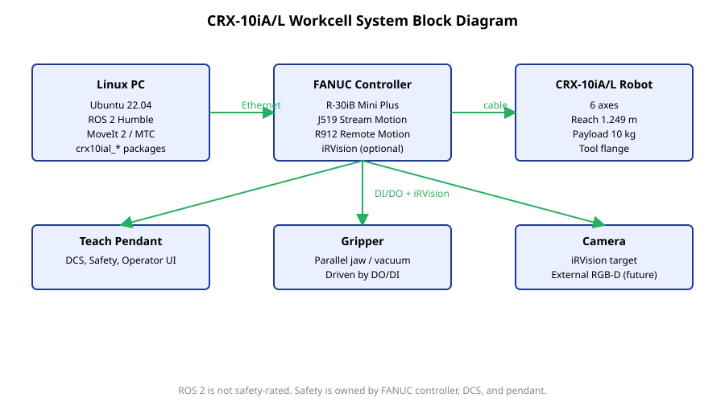

# System Block Diagram

The diagram below shows the physical and logical components in a CRX-10iA/L workcell as the project targets it.

## Roles

- **Linux PC** runs Ubuntu 22.04 with ROS 2 Humble. It hosts MoveIt 2, MoveIt Task Constructor, the FANUC ROS 2 driver, and the project's `crx10ial_*` packages.
- **FANUC Controller (R-30iB Mini Plus)** runs the safety-rated motion control. It exposes ROS 2 access via J519 Stream Motion and the Remote Motion Interface (R912). iRVision runs here when the option is installed.
- **CRX-10iA/L Robot** is the 6-axis collaborative arm.
- **Teach Pendant** is the operator UI and source of authority for safety configuration (DCS).
- **Gripper** is end-effector hardware. The first project iteration treats it as a fake/mock element with optional digital I/O. Real grippers (parallel jaw, vacuum) are added behind the gripper service abstraction.
- **Camera** is the iRVision-targeted device or a future external RGB-D sensor.

## Connections

- Linux PC <-> Controller: Ethernet. Carries Stream Motion, RMI, and ROS 2 to driver traffic.
- Controller <-> Robot: cable.
- Controller <-> Gripper: digital I/O.
- Controller <-> Camera: iRVision interface (controller-side image processing).

## What is and is not safety-rated

The FANUC controller and its DCS configuration are safety-rated. ROS 2 application code is not. Any feature that affects the robot's motion safety must be implemented and reviewed on the controller side (Teach Pendant, DCS, payload schedule).

For the layered software stack that runs on the Linux PC, see [software_overview.md](software_overview.md). For frame conventions used inside the cell description, see [frames.md](../frames.md).
