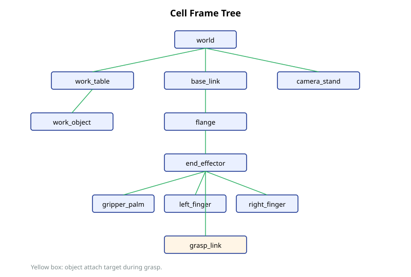
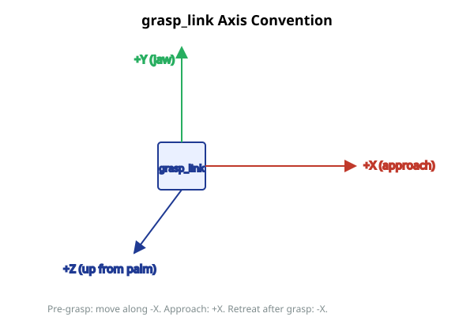

# Frame Conventions

This document is the canonical reference for the frames used by the CRX-10iA/L workcell. It supersedes `docs/gripper_frames.md`, which now points here.

## Frame catalog

| Frame | Owner | Purpose |
|---|---|---|
| `world` | cell xacro | Fixed root of the workspace. All static cell objects ultimately attach here. |
| `base_link` | FANUC URDF | Robot base. Origin at the bolt-down face. |
| `flange` | FANUC URDF | Tool mounting interface. |
| `end_effector` | cell xacro | Project-side anchor for tooling, parented to `flange`. Used as the MTC IK frame's parent in mock. |
| `tool_link` | cell xacro | Project tool root. Gripper geometry parents here. |
| `gripper_palm` | cell xacro | Gripper body collision. |
| `left_finger` / `right_finger` | cell xacro | Parallel-jaw fingers. Collision geometry only; not actuated. |
| `grasp_link` | cell xacro | Frame at which objects attach during grasp. Origin offset 0.18 m in `+X` from `tool_link`. |
| `work_table` | mock_scene runtime publisher | Static collision: 1.0 x 0.7 x 0.04 box at world (0.75, 0, 0.70). |
| `work_object` | mock_scene + fake_gripper | Static collision when on the table; attached collision when grasped. |
| `camera_stand` | mock_scene | Static collision representing the camera fixture. |

## grasp_link convention

`grasp_link` defines orientation as well as position.

- **+X** is the approach direction from wrist toward the object.
- **+Y** is the parallel-jaw opening direction.
- **+Z** completes the right-handed frame and points up from the palm.

This is consistent with FANUC's tool0 convention (X forward) and is the reason approach directions are encoded as `[1.0, 0.0, 0.0]` in `fixed_pick_place.yaml`.

Pre-grasp poses sit at `grasp_pose - approach_max * +X`. Approach proceeds `+X` to `grasp_pose`. Retreat is `-X`.

## Workcell coordinates

The mock workcell uses these world-frame coordinates by convention. Both the cell xacro and `mock_scene` reference them; values must stay in sync.

| Object | Center (x, y, z) m | Size (x, y, z) m |
|---|---|---|
| `work_table` | (0.75, 0.0, 0.70) | (1.0, 0.7, 0.04) |
| `work_object` (free) | (0.55, 0.0, 0.745) | (0.08, 0.08, 0.05) |
| `camera_stand` | (0.35, -0.55, 0.35) | (0.05, 0.05, 0.70) |

These come from M2 (`crx10ial_cell.urdf.xacro`) and `crx10ial_bringup/mock_scene.py`. When changing them, update both files; a mismatch breaks planning-scene consistency.

## Frame ownership policy

- **Static world geometry** is published by `mock_scene_publisher` (in `crx10ial_bringup`) as MoveIt collision objects. The cell xacro contains the same geometry as URDF for visualization, but MoveIt's planning view comes from the publisher, not the URDF.
- **Robot links** come from the FANUC URDF.
- **Project tool links** come from the cell xacro.
- **Attached objects** are owned by `crx10ial_gripper` at runtime (see `docs/decisions/0003-fake-gripper-as-runtime-scene-owner.md`).
